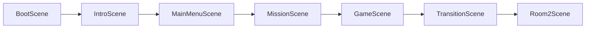
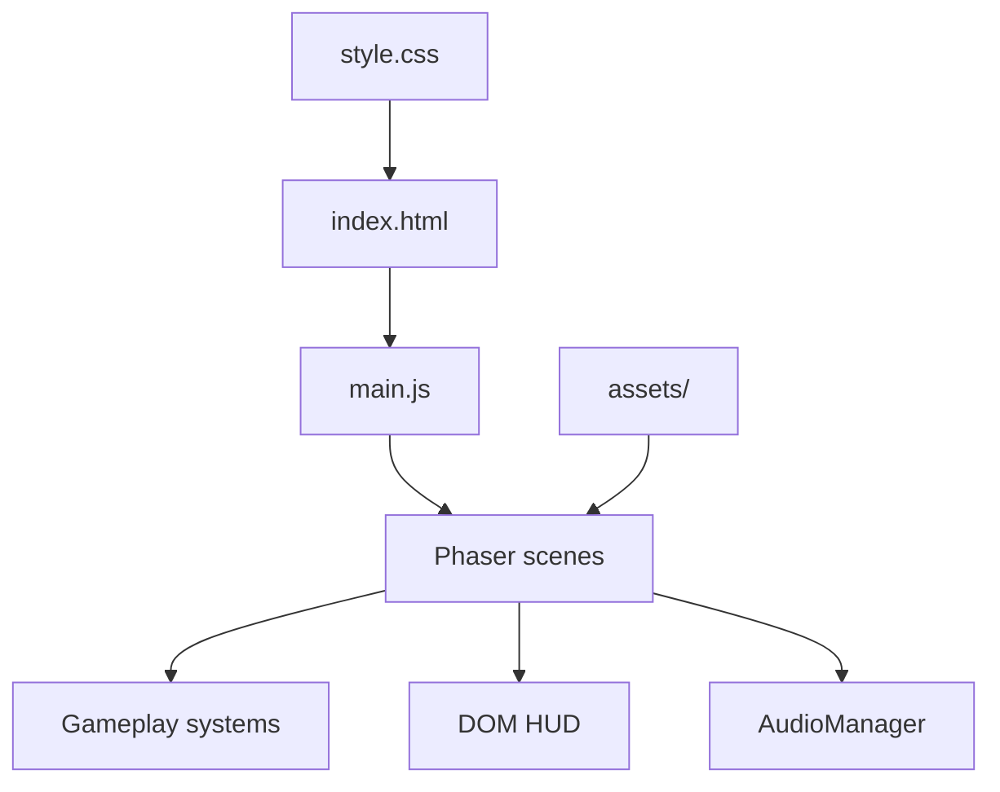

# Tiny Thief - Project Analysis

## Overview

| Aspect | Detail |
| --- | --- |
| Package | `stealth-bedroom-prototype` |
| Game title | Tiny Thief / Meme Panic Stealth |
| Stack | Phaser 3, Vite 5, ES modules |
| Rendering | Phaser canvas for gameplay, DOM/CSS for shell HUD |
| Current scope | Full intro/menu/mission flow plus two playable rooms |
| Verification | `npm run build` passes |

Tiny Thief is a top-down stealth prototype. The player collects all loot in a
room, avoids sound-based owner reactions, hides when the owner wakes up, and
escapes before the timer creates a full-panic chase.

## Scene Flow



### Scene Responsibilities

| Scene | Purpose |
| --- | --- |
| `BootScene` | Preloads shared images and audio, then starts the intro. |
| `IntroScene` | Neon "GANESH GAMES" presentation sequence. |
| `MainMenuScene` | Rainy neon title menu with play/settings/quit entries. |
| `MissionScene` | How-to-play briefing and start prompt. |
| `GameScene` | Room 1 gameplay: cozy bedroom tutorial heist. |
| `TransitionScene` | Cinematic city/rain transition between rooms. |
| `Room2Scene` | Room 2 gameplay: harder gamer/tech room. |

`main.js` registers all scenes and configures the Phaser game at 960x640 with
Arcade physics, pixel-art rendering, and scale-fit centering.

## Architecture



The project uses a hybrid UI model:

- Phaser canvas handles rooms, characters, loot, lighting, particles, physics,
  tweens, and SFX.
- HTML/CSS handles the outer HUD, sidebar, objective status, timer, prompt, and
  end-screen modal.
- Scenes update HUD elements directly with `document.getElementById`.

This is pragmatic for a prototype and keeps HUD styling simple, but it also
means scene code depends on specific DOM IDs.

## Core Gameplay

### Player

- Movement: WASD or arrow keys.
- Sprinting: Shift increases speed and adds noise over time.
- Interaction: E collects loot, hides, and confirms exit.
- Movement feel: velocity interpolation and high drag for smooth stopping.
- Sprite readability: active outline/shadow follows the player.

### Sound-Based Stealth

`NoiseSystem` tracks internal noise events and forwards direct sound reactions
to `OwnerAI`. The visible suspicion meter is no longer part of the gameplay.

Main noise sources:

- Sprinting.
- Wall bumps.
- Furniture bumps.
- Loot pickup.
- Room 2 cable-zone movement.

Small sounds can stir the owner, medium sounds wake the owner into search, and
loud actions can trigger a chase immediately.

### Owner AI

`OwnerAI` implements the shared owner behavior:

- Sleeping or idle.
- Stir/search/chase response from sound events.
- Alert phase before full chase.
- Chase behavior toward the player.
- Safe-zone behavior when the player hides.
- Reset-to-sleep flow after the player stays hidden/quiet.

Room 2 tunes the AI harder with lower wake thresholds, faster chase speed, and
patrol points.

### Loot And Escape

Room 1 uses `LootSystem`:

- Bottle
- Gold
- Key
- Gem

Room 2 currently implements its loot locally:

- GPU
- Headphones
- Keyboard
- Gaming Mouse
- Crypto USB

The exit only works after all room loot is collected. Reaching the exit early
updates the prompt and shakes the UI instead of completing the room.

### Timer

`TimerSystem` starts a countdown in gameplay scenes:

- Room 1 uses the default duration.
- Room 2 starts at 120 seconds.
- Under 30 seconds, the timer enters an urgent visual state.
- At zero, the owner enters full panic/chase mode.

### Ranks And End Screens

`RankSystem` calculates an escape result using:

- Total accumulated noise.
- Whether a chase happened.
- Whether full panic happened.
- Whether the player hid successfully.

It renders the shared DOM end screen for escape or busted outcomes.

## Room 1

`GameScene` is the tutorial/cozy bedroom heist.

Key features:

- 4 loot items.
- Closet safe zone.
- Owner sleeping near the bed.
- Exit at the top center.
- Furniture collision footprints.
- Prompt, loot, and timer HUD integration.
- Transition to Room 2 after escape.

Room 1 uses the shared `LootSystem`, `NoiseSystem`, `OwnerAI`, `TimerSystem`,
`RankSystem`, `FurnitureSystem`, `AudioManager`, and `MuteButton`.

## Room 2

`Room2Scene` is a harder gamer/tech room.

Key features:

- 5 tech-themed loot items.
- Wardrobe safe zone.
- Owner sleeping on the sofa.
- Cable zone that creates extra noise while moving through it.
- Harder owner AI thresholds and patrol behavior.
- Final escape screen after completion.

Room 2 reuses most systems, but its loot creation and pickup methods are local
to `Room2Scene`.

## Assets

Current media layout:

```text
assets/
├── background/
├── characters/
├── furniture/
├── props/
├── room2/
└── sounds/

public/assets/
└── duplicated copy of the asset tree
```

The game currently loads paths like `assets/...`, so `assets/` is the active
runtime tree. `public/assets/` appears duplicated and should be reviewed before
keeping both.

Approximate local sizes from analysis:

| Path | Size |
| --- | --- |
| `assets/` | 69 MB |
| `public/assets/` | 70 MB |
| `dist/` | 88 MB |
| `node_modules/` | 181 MB |

## Build Result

`npm run build` completed successfully.

Vite warning:

- The generated JS bundle is larger than 500 kB after minification.
- This is expected for a Phaser app, but code splitting/manual chunks can be
  considered later if deployment size matters.

## Strengths

- Complete playable vertical slice with intro, menu, briefing, gameplay,
  transition, second room, win, lose, and replay.
- Good scene separation for non-gameplay screens.
- Useful reusable systems for AI, noise, timer, furniture, audio, and ranks.
- Strong visual polish: rain, glows, dust, pulses, scanlines, screen shake,
  pickup VFX, and animated transitions.
- Audio state persists across scenes through `AudioManager`.

## Current Risks

1. `Room2Scene` plays footstep audio directly, so footsteps can ignore the SFX
   mute toggle.
2. `index.html` starts with Room 1-specific HUD/sidebar/footer copy, even after
   the game reaches Room 2.
3. `assets/` and `public/assets/` duplicate about 70 MB of media.
4. `BootScene` preloads shared assets, but gameplay scenes still repeat some
   preload work.
5. Scene code writes directly to DOM IDs, so HTML changes can break runtime UI.
6. Room 2 loot logic duplicates concepts from `LootSystem` instead of using a
   shared configurable loot module.

## Recommended Next Steps

### Quick Fixes

- Gate Room 2 footsteps behind `AM.sfxMuted`.
- Update HUD/sidebar/footer text when entering Room 1 vs Room 2.
- Confirm whether `public/assets/` is needed; remove it if unused.
- Update `task.md` so completed scene work is marked done.

### Medium Improvements

- Move Room 2 loot into a configurable/shared loot system.
- Centralize room definitions: loot, safe zone, exit zone, owner config, timer.
- Make `BootScene` the single asset preload source where possible.
- Add a small HUD adapter instead of raw `document.getElementById` calls in
  every system.

### Larger Improvements

- Add mobile/touch controls.
- Add a third room using a data-driven room config.
- Add guard vision cones or distraction items.
- Add Playwright smoke checks for scene load, HUD updates, and mute behavior.

## How To Run And Debug

```bash
npm install
npm run dev
```

Debug collision overlays:

```text
http://127.0.0.1:5173/?debugWalls=true
```

Production build:

```bash
npm run build
```
