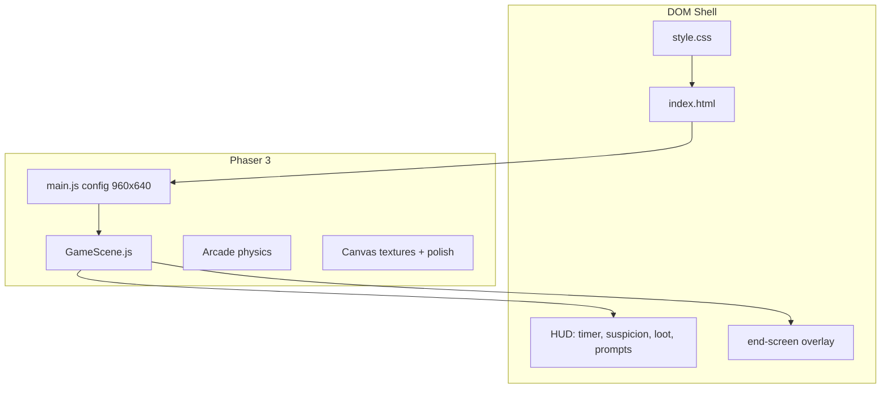

# Meme Panic Stealth — Project Analysis

## What it is

| Aspect | Detail |
|--------|--------|
| **Package** | [`stealth-bedroom-prototype`](package.json) |
| **Stack** | Phaser 3.80 + Vite 5, ES modules |
| **Scope** | One tutorial room (`ROOM 1`), ~1660 lines of game logic |
| **Run** | `npm run dev` (Vite), `npm run build` → [`dist/`](dist/) |

The game is a **top-down stealth prototype**: collect loot, manage suspicion/noise, hide in the closet during chase, escape before the timer hits zero.

---

## Architecture



**Hybrid rendering model**

- **Phaser canvas**: room, sprites, particles, tweens, physics, SFX
- **DOM/CSS**: layout shell, sidebar legend, objective bar, end-game card ([`index.html`](index.html), [`style.css`](style.css))
- **Bridge**: `GameScene` reads/writes DOM via `getElementById` (`createUI`, `updateNoiseUI`, `updateLootUI`, `showEscapeScreen`)

**Entry point** — minimal Phaser boot in [`main.js`](main.js): single scene, pixel-art flags, zero gravity arcade physics.

**Monolith** — All gameplay lives in [`scenes/GameScene.js`](scenes/GameScene.js). No scene manager, no shared utilities module, no asset manifest beyond inline `preload()`.

---

## Core gameplay systems

### 1. Movement and feel

- WASD / arrows; SHIFT sprint adds **+0.12 noise/sec**
- Velocity lerp factor `0.28`, drag `1000`
- 22×16 foot hitbox; 4 walk textures + idle

### 2. Suspicion / noise

- Meter 0–1; thresholds **0.55** (stir) and **0.8** (chase)
- Sources: sprint, wall/furniture/plant bumps, bottle pickup (+0.45)
- Passive decay: 0.035/sec (0.02 during chase)
- HUD bar synced via `updateNoiseUI()`

### 3. Owner AI

- States: sleeping → chase on high noise or timer panic
- Chase: pathing toward player with detour/stuck recovery (`handleOwner`)
- **Caught**: overlap with owner → `onCaught()` → busted screen
- **Calm down**: 5s in closet safe zone OR successful hide (`resetOwnerToSleep`)

### 4. Loot and escape gate

**4 collectibles** in code ([`createLootItems`](scenes/GameScene.js)): bottle, gold, key, gem.

- `E` within range collects nearest loot (`getClosestLootItem`)
- Exit zone at top center; `allLootCollected()` required
- Early exit → `onExitDenied()` (UI shake + prompt)

### 5. Timer and full panic

- Starts **150s** (`02:30`); urgent UI under 30s
- At 0: `triggerFullPanicMode()` — permanent wake, chase, screen shake

### 6. Stealth ranks (win)

Evaluated in `calculateRank()`: Perfect Thief, Clean Escape, Silent Rat, Panic Survivor, Chaos Goblin — based on chase history, panic flag, accumulated noise, hide success.

### 7. Visual pipeline

`prepareVisualTexture()` — canvas crop + optional corner color-key + nearest filter. Procedural loot textures for book/gem kinds in `createLootTexture()` (mostly unused for current loot set).

**Polish**: dust, room glow, vignette, exit pulse when ready, loot ADD glows, pickup VFX, `?debugWalls` wall overlay.

### 8. Audio

`playSfx()` with `minGap` cooldown; footstep intervals walk 260ms / sprint 180ms.

---

## Assets and repo layout

```
challange/
├── main.js, index.html, style.css
├── scenes/GameScene.js          # all logic
├── assets/                      # PNG + MP3 (referenced in preload)
└── dist/                        # built bundle (in git status)
```

[`assets/README.md`](assets/README.md) says “placeholder / generated in code” but the game **loads real PNGs** from `assets/` — the readme is outdated.

**Git (in progress)**: modified `GameScene.js`, `style.css`, `index.html`, `chair.png`, rebuilt `dist/` bundle.

---

## UI / documentation inconsistencies

| Issue | Expected (code/readme) | Actual (UI) |
|-------|------------------------|-------------|
| Loot count | **4** items | Sidebar shows **`0/3`** ([`index.html`](index.html) L56) |
| Hide control | **E** near closet during chase | Sidebar says **SPACE** (L48) |
| Footer objects | Book, Drawer, TV, etc. | Mostly flavor; not all are interactable loot/obstacles |
| Readme loot | Documents 4 items | Matches code; HTML does not |

**Gold loot visual bug** in `createLootItems()`:

- `goldSprite` at **(130, 520)** (chair corner)
- `goldGlow` / `goldShadow` at **(328, 360)** (desk area)

Pickup uses sprite position, so gameplay works but **glow/ring/shadow are misplaced** — likely copy-paste error.

---

## Collision model (current)

| Object | Collision |
|--------|-----------|
| Room walls | Static rectangles (`addWall`) |
| Bed | `addSolidObstacle` — furniture bump noise |
| Plants | Soft zone + solid core — lighter plant bump |
| Desk / chair | **Visual only** (desk collider removed per readme) |
| Closet | Safe zone rect + block for owner; hide via E |
| Owner | Walls + safe block; does not collide with furniture |

---

## Strengths

- **Complete vertical slice**: win/lose flows, ranks, stats, replay
- **Strong juice**: tweens, particles, SFX discipline, end screens
- **Tunable stealth loop**: noise decay, closet calm-down, timer pressure
- **Readable HUD**: suspicion + timer + objectives outside canvas

---

## Risks and scaling limits

1. **Single 1660-line scene** — hard to add Room 2, new enemies, or tests without splitting modules/scenes.
2. **DOM coupling** — scene assumes specific element IDs; breaks if HTML changes.
3. **Manual colliders** — green debug boxes; art moves require retuning rectangles.
4. **Committed `dist/`** — easy for stale builds vs source; prefer CI build or `.gitignore` dist.
5. **Stale shell copy** — misleads players (0/3, SPACE) and understates loot count.

---

## Suggested next steps (from readme + analysis)

**Quick fixes (low effort)**

- Fix loot HUD to `0/4` (dynamic from `lootTotal` on first paint)
- Align controls copy: E for interact/hide; remove or implement SPACE
- Fix gold glow/shadow coordinates to match `goldSprite`
- Sync [`readme.md`](readme.md) / footer legend with actual interactables

**Medium (prototype → game)**

- Extract `NoiseSystem`, `LootSystem`, `OwnerAI` from `GameScene`
- Second scene / level loader with shared HUD
- Vision cone or patrol guard as new obstacle type

**Larger**

- Touch / virtual joystick ([readme](readme.md) suggestion)
- Mobile viewport layout for sidebar
- Stop tracking `dist/`; build in deploy pipeline

---

## How to run and debug

```bash
npm install
npm run dev
```

- Open with `?debugWalls` to show wall collider overlays
- Chase: noise ≥ 0.8 or timer expiry
- Win: collect all 4 loot, reach EXIT with E when prompted
